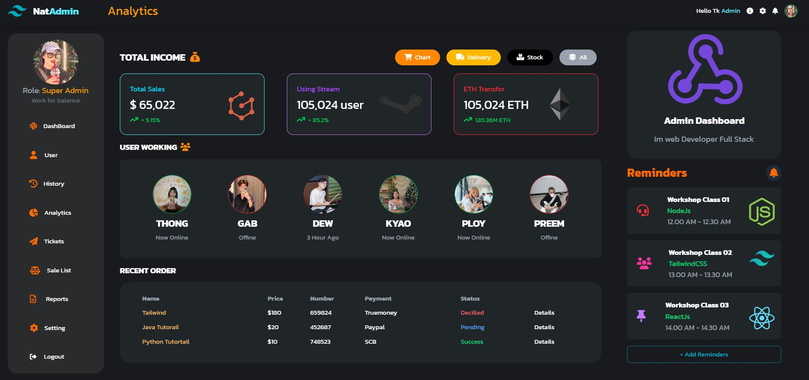
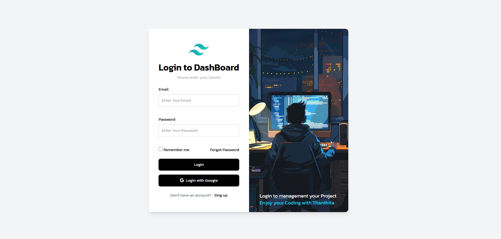

# 🧩 Admin Dashboard with Tailwind CSS

A modern and responsive **Admin Dashboard** built using **Tailwind CSS**. 
### Dashboard Page

### Login Page

## 🚀 Features

- 📊 **Real-time statistics and analytics**
- 👤 **User status**: online, offline, last active
- 🧾 **Recent orders** with status: Success / Pending / Declined
- 🔔 **Reminders section** for upcoming events or classes
- 🔐 **Login page** with email login and Google sign-in
- 🌙 **Dark mode interface** for a clean and comfortable UI

## 🛠️ Built With

- [Tailwind CSS](https://tailwindcss.com/)
- HTML 
